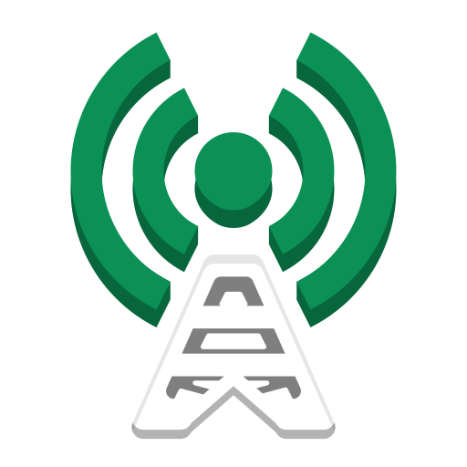
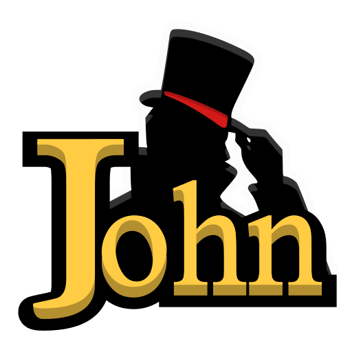
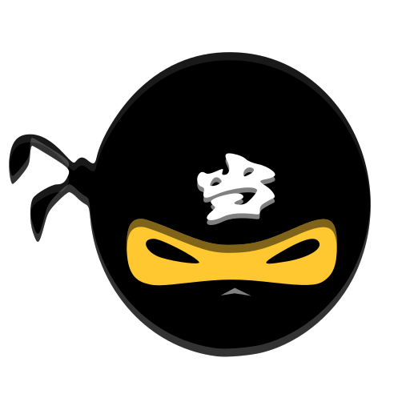

<h1 align="left">👋 Hi!</h1>

  Welcome to my GitLabs. 
  A place for experiments and cybersecurity exploration. Don’t forget to prepare some coffee before entering ☕

  ☕ I actually don’t like coffee. 
  🔐 Let’s explore the world of cybersecurity together. 
  🛠️ Building devices and learning cybersecurity are my hobbies.

<h2 align="left">OS and devices I work with</h2>

  
  
  
  
  
  
  
  
  

<h2 align="left">What I Do</h2>

  
  
  
  

  
  
  
  
  
  
  
  
  
  
  
  
  
  
  

 

<h3 align="center">🐍 Feed him</h3>
<picture>
  <source media="(prefers-color-scheme: dark)" srcset="https://raw.githubusercontent.com/root-abdullLabs/root-abdullLabs/snake-output/snake-dark.svg">
  <source media="(prefers-color-scheme: light)" srcset="https://raw.githubusercontent.com/root-abdullLabs/root-abdullLabs/snake-output/snake.svg">
  
</picture>